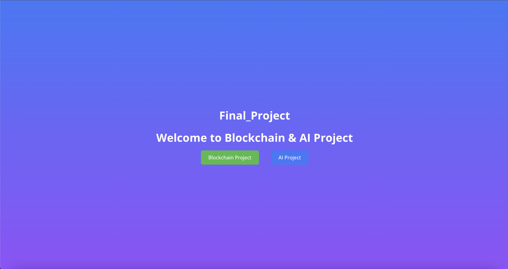

# Final Year Project Documentation
> This Is Final Year Project Based On Blockchain And AI

## Overview

The application uses the following components:

- Next.js for the frontend and backend server
- The OpenAI API for chat interactions
- Blockchain (ERC-1155 & 721 (Minting NFT))
- Tailwind CSS for styling
- Apideck components for toast notifications and modals

